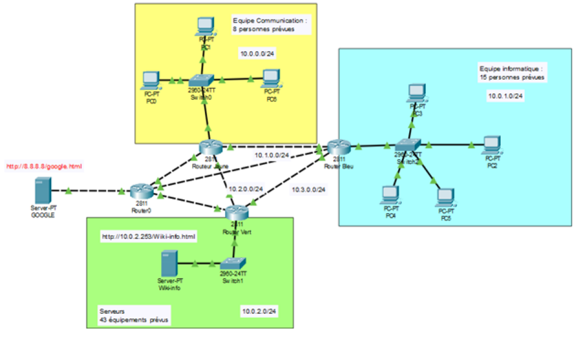

Exercice : A la bonne adresse
Suite à l'expansion de l'entreprise Engie celle-ci a comme projet d'étendre son réseau informatique. Avant de pouvoir procéder en production à cette expansion, deux grandes problématiques réseaux apparaissent au niveau de la maquette de test.

 

La première est que certaines équipes ne peuvent pas atteindre tous les services. Plus précisément l'équipe communication a besoin d'accéder au Wiki de l'équipe informatique pour rédiger des réponses à des appels d'offre. Cela n'a pas l'air de fonctionner alors que l'équipe informatique n'a, elle, aucun problème pour y accéder. Est-ce un problème d'attribution automatique des adresses privées ou un simple souci de routage ? Afin de comprendre pourquoi cela ne fonctionne plus la société eXia a conseillé à l'administrateur du réseau d'utiliser des commandes de diagnostiques. Ce dernier a réalisé un ping vers le serveur web, qui a donné comme message d'erreur « destination host unreachable ». Il faut donc approfondir ces recherches afin de résoudre ce problème qui n'affecte sans doute pas que ce service.

 

La deuxième est que nous devons refondre notre plan d'adressage afin de le rendre plus adapté à notre utilisation. Certains réseaux n'utilisant que deux IPs en consomme 254... ce qui entraîne de gros gaspillage d'IPs qui pourraient être utilisés pour les nouveaux arrivants.

 

Voici un schéma simplifié de l'infrastructure sur laquelle nous aimerions nous entraîner afin de pouvoir, ensuite, adapter notre solution à l'ensemble de notre entreprise :

Exercice : A la bonne adresse
Suite à l'expansion de l'entreprise Engie celle-ci a comme projet d'étendre son réseau informatique. Avant de pouvoir procéder en production à cette expansion, deux grandes problématiques réseaux apparaissent au niveau de la maquette de test.

 

La première est que certaines équipes ne peuvent pas atteindre tous les services. Plus précisément l'équipe communication a besoin d'accéder au Wiki de l'équipe informatique pour rédiger des réponses à des appels d'offre. Cela n'a pas l'air de fonctionner alors que l'équipe informatique n'a, elle, aucun problème pour y accéder. Est-ce un problème d'attribution automatique des adresses privées ou un simple souci de routage ? Afin de comprendre pourquoi cela ne fonctionne plus la société eXia a conseillé à l'administrateur du réseau d'utiliser des commandes de diagnostiques. Ce dernier a réalisé un ping vers le serveur web, qui a donné comme message d'erreur « destination host unreachable ». Il faut donc approfondir ces recherches afin de résoudre ce problème qui n'affecte sans doute pas que ce service.

 

La deuxième est que nous devons refondre notre plan d'adressage afin de le rendre plus adapté à notre utilisation. Certains réseaux n'utilisant que deux IPs en consomme 254... ce qui entraîne de gros gaspillage d'IPs qui pourraient être utilisés pour les nouveaux arrivants.

 

Voici un schéma simplifié de l'infrastructure sur laquelle nous aimerions nous entraîner afin de pouvoir, ensuite, adapter notre solution à l'ensemble de notre entreprise :

